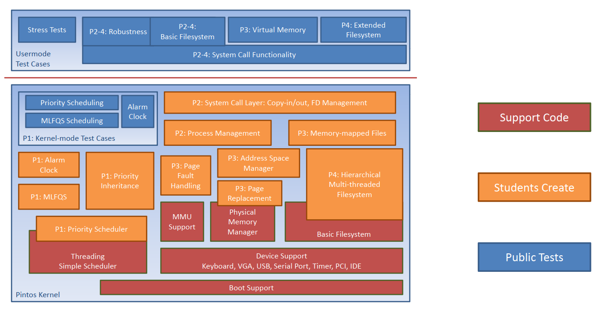

# PintOS-Project
## About
PintOS is an open source instructional operating system kernel developed by Stanford University. PintOS provides complete documentation & modular projects to introduce students to the major concepts of operating systems development. The components of PintOS project is illustrated in the following figure.

The project is divided into four phases:
- P1: Threads
- P2: User Programs
- P3: Virtual Memory
- P4: File Systems

I have done the first two phases 
1. Phase1 is done with all testcases passing
2. Phase2 is done also but still some testcases (bad syscalls) + maybe 3 others Not passing
   I may try to solve them later :) - I will not - .
   but definitly there will be time for the other 2 phases In shaa Allah

## References 
- [PintOS Official Doc](https://web.stanford.edu/class/cs140/projects/pintos/pintos.pdf)
- [PintOS Guide](https://static1.squarespace.com/static/5b18aa0955b02c1de94e4412/t/5b85fad2f950b7b16b7a2ed6/1535507195196/Pintos+Guide)
- [Phase1 Session (Arabic)](https://youtu.be/RLx_0nnEjaM?si=h-63VZMMNYGi1sS6) 
- [Phase2 Session (Arabic)](https://youtu.be/bFUmvVgmbOs?si=Jgb4LJU5MhDHL0Q_) 
- [EE415: Intro. to Operating System PintOS playlist](https://youtube.com/playlist?list=PLmQBKYly8OsWiRYGn1wvjwAdbuNWOBJNf&si=cQYS2AKQgEGaQ59_)
